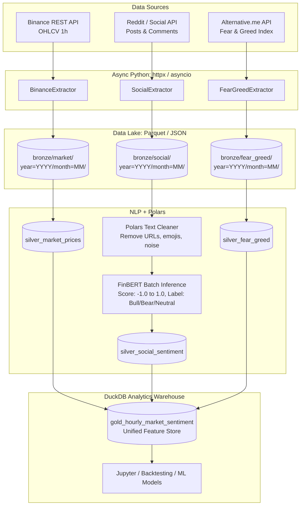

# Product Requirements Document (PRD)
## Market Intelligence Engine: Financial Sentiment & High-Frequency Price Ingestion Pipeline

**Versión:** 1.0.0  
**Estado:** Activo / En desarrollo  
**Tipo de Sistema:** Motor ELT asíncrono, Medallion Architecture (Bronze/Silver/Gold), NLP Ingestion Engine  
**Audiencia Objetivo:** Cuantitativos, Investigadores de ML, Ingenieros de Datos en Hedge Funds y FinTechs  

---

## 1. Resumen Ejecutivo (Executive Summary)

El **Market Intelligence Engine** es una plataforma de datos moderna diseñada para capturar, procesar y enriquecer flujos heterogéneos del mercado financiero. Cruza series temporales financieras de alta frecuencia (velas OHLCV 1h) con señales de comportamiento humano y sentimiento macro/social (foros, noticias, Crypto Fear & Greed Index).

A través de un pipeline ELT asíncrono basado en Python y una arquitectura Medallion, la plataforma transforma texto no estructurado en métricas numéricas vectorizadas mediante modelos de procesamiento de lenguaje natural (NLP) especializados en finanzas (**FinBERT**), entregando un almacén columnar en **DuckDB** optimizado para backtesting y modelos predictivos de volatilidad.

---

## 2. Objetivos del Producto y Métricas de Éxito

| Objetivo | Descripción | Métrica Clave |
| :--- | :--- | :--- |
| **Consolidación Multimodal** | Unificar series de precios continuas con flujos de texto asíncronos e irregulares. | 100% de alineación temporal horaria sin huecos no detectados. |
| **Enriquecimiento FinBERT** | Cuantificar el sentimiento de noticias y posts en un score escalar $[-1.0, 1.0]$ y etiqueta categórica (`Bullish`, `Bearish`, `Neutral`). | Inferencia batch $\ge 100$ textos/segundo en CPU/GPU sin bloqueos de memoria. |
| **Rendimiento Asíncrono** | Ingestión concurrente sin esperas secuenciales. | Ingestión simultánea de 3 fuentes en $< 5$ segundos por ciclo horario. |
| **Tolerancia a Fallos** | Resistencia a rate limits estrictos y cortes transitorios de APIs externas. | $0$ fallos no controlados mediante Exponential Backoff con jitter. |

---

## 3. Orígenes de Datos (The "Where")

### 3.1. Datos de Mercado (Precio y Volumen)
* **Fuente:** Binance REST API (`GET /api/v3/klines`) y soporte para Yahoo Finance (`yfinance`).
* **Frecuencia:** Velas japonesas de 1 hora (`1h`).
* **Campos:** `timestamp_open`, `open`, `high`, `low`, `close`, `volume`, `trades_count`, `quote_asset_volume`.
* **Activo Principal:** `BTCUSDT` (extensible a acciones tecnológicas o altcoins).

### 3.2. Sentimiento Social y Noticias
* **Fuente:** Reddit API (PRAW / JSON API pública) y feeds de noticias financieras.
* **Comunidades:** `r/CryptoCurrency`, `r/WallStreetBets`, `r/Bitcoin`.
* **Campos:** `post_id`, `created_utc`, `title`, `selftext`, `author`, `upvotes`, `num_comments`.
* **Manejo de Rate Limits:** Cola de peticiones asíncronas con pausas dinámicas según headers `X-Ratelimit-*`.

### 3.3. Macro-Sentimiento (El termómetro del miedo)
* **Fuente:** Alternative.me Crypto Fear & Greed Index REST API (`https://api.alternative.me/fng/`).
* **Frecuencia:** Diaria / Horaria acumulada.
* **Campos:** `value` (0 a 100), `value_classification` (Extreme Fear, Fear, Neutral, Greed, Extreme Greed), `timestamp`.

---

## 4. Arquitectura del Sistema (Medallion Architecture)



---

## 5. Especificación de las Capas de Datos

### 5.1. Bronze Layer (Landing Cruda)
* **Objetivo:** Inmutabilidad, fidelidad total con la API de origen.
* **Formato:** Parquet / JSON comprimido.
* **Estructura de Directorios:**
  `data/bronze/{source}/year={YYYY}/month={MM}/day={DD}/{source}_{timestamp}.parquet`

### 5.2. Silver Layer (Limpieza & Inferencia)
* **Limpieza:** Normalización UTF-8, eliminación de menciones, enlaces regex, normalización de tickers (`$BTC` $\to$ `BTC`).
* **FinBERT Processing:** Inferencia en batches (ej. 64 textos) para maximizar rendimiento de CPU/GPU.
* **Output:**
  * `sentiment_score`: flotante $[-1.0, 1.0]$.
  * `sentiment_label`: `bullish`, `bearish`, `neutral`.
  * `confidence`: probabilidad softmax del modelo.

### 5.3. Gold Layer (Modelado Analítico)
* **Motor:** DuckDB (o ClickHouse para escala multi-terabyte).
* **Esquema de la tabla consolidada:** `gold_hourly_market_sentiment`

```sql
SELECT
    m.timestamp_hour,
    m.asset_ticker,
    m.close_price,
    m.volume,
    AVG(s.sentiment_score) AS avg_hourly_sentiment,
    COUNT(s.post_id) AS social_volume_mentions,
    SUM(CASE WHEN s.sentiment_label = 'bullish' THEN 1 ELSE 0 END) AS bullish_mentions,
    SUM(CASE WHEN s.sentiment_label = 'bearish' THEN 1 ELSE 0 END) AS bearish_mentions,
    fg.fear_and_greed_score,
    fg.fear_and_greed_classification
FROM silver_market_prices m
LEFT JOIN silver_social_sentiment s
    ON m.timestamp_hour = date_trunc('hour', s.created_utc)
LEFT JOIN silver_fear_greed fg
    ON date_trunc('day', m.timestamp_hour) = fg.date
GROUP BY 1, 2, 3, 4, 9, 10
ORDER BY m.timestamp_hour DESC;
```

---

## 6. Requisitos No Funcionales (Resiliencia y Concurrencia)

1. **Exponential Backoff con Jitter:**
   $$\text{espera} = \min(\text{max\_backoff}, \text{base} \times 2^{\text{intento}}) + \text{random\_jitter}$$
2. **Modularidad y Desacoplamiento:** Cada extractor hereda de `BaseAsyncExtractor` garantizando interfaz homogénea `extract() -> List[Dict]`.
3. **Idempotencia:** La ejecución repetida de un rango temporal sobre Bronze o Silver no duplica registros gracias a claves únicas de evento (`post_id`, `kline_open_time`).
